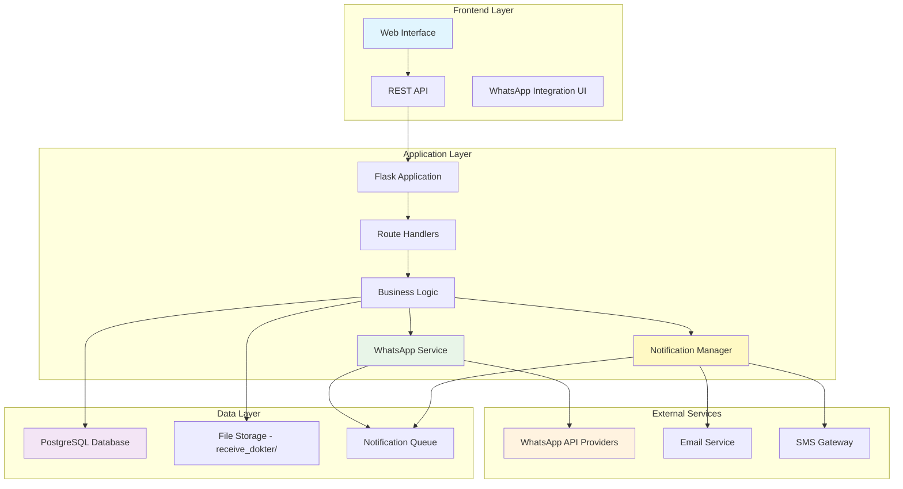
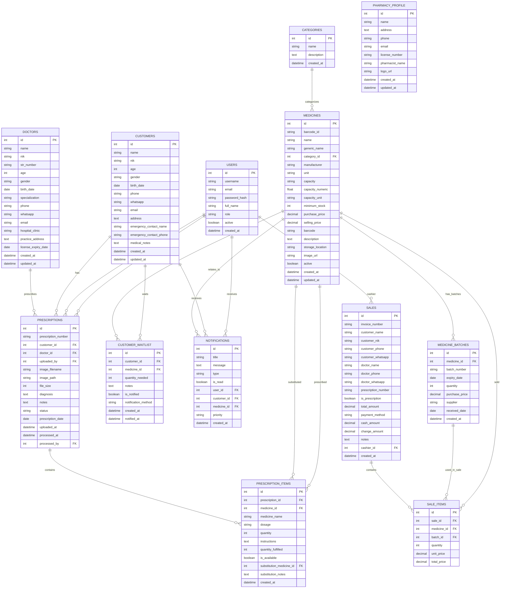
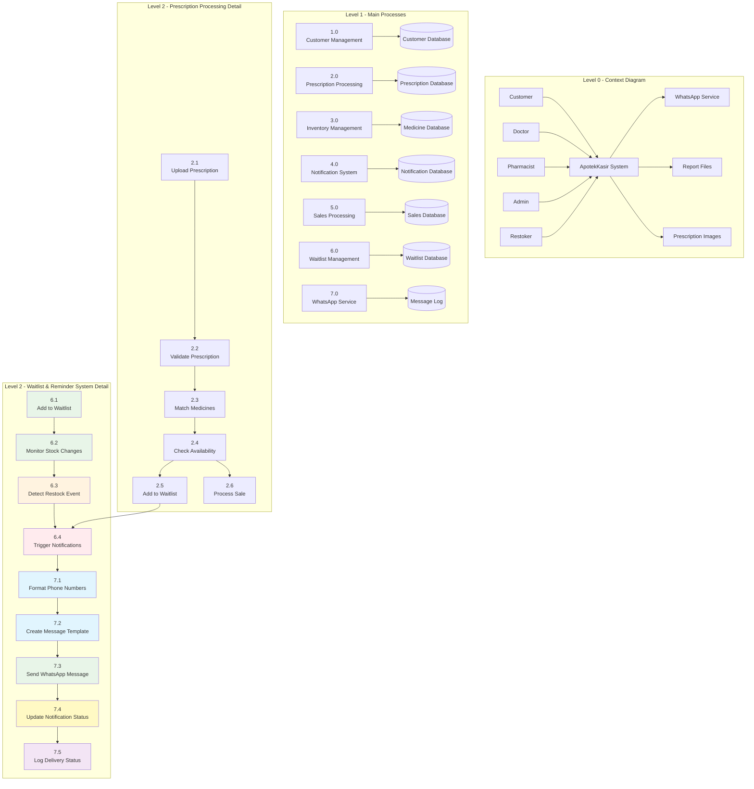
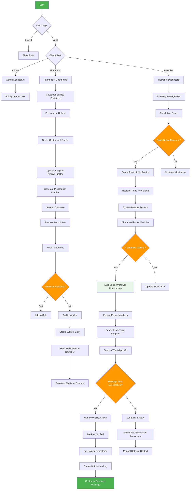
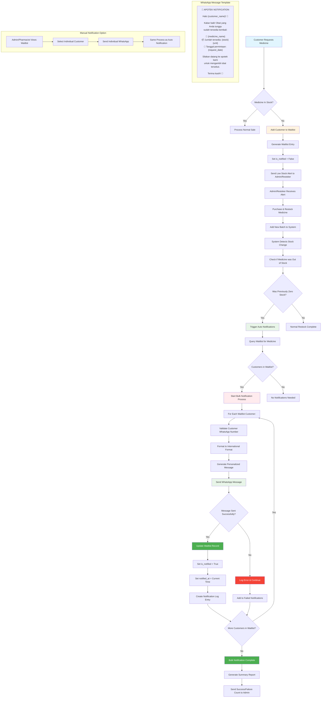

# 🏥 ApotekKasir - Sistem Manajemen Apotek

Sistem manajemen apotek yang komprehensif dengan fitur manajemen pelanggan, dokter, resep, inventori, dan **sistem reminder otomatis dengan notifikasi WhatsApp**.

## 📋 Daftar Isi
- [Fitur Utama](#-fitur-utama)
- [Sistem Reminder & Waitlist](#-sistem-reminder--waitlist)
- [Arsitektur Sistem](#-arsitektur-sistem)
- [Entity Relationship Diagram](#-entity-relationship-diagram)
- [Data Flow Diagram](#-data-flow-diagram)
- [System Workflow](#-system-workflow)
- [Reminder System Workflow](#-reminder-system-workflow)
- [Panduan Instalasi](#-panduan-instalasi)
- [Panduan Pengguna](#-panduan-pengguna)
- [Manajemen Role & Permission](#-manajemen-role--permission)
- [API Documentation](#-api-documentation)

## 🚀 Fitur Utama

### 👥 Manajemen Data Master
- **Manajemen Pelanggan**: Data lengkap dengan NIK, kontak darurat, riwayat medis
- **Manajemen Dokter**: Data praktik, spesialisasi, nomor STR, masa berlaku
- **Manajemen Obat**: Inventori dengan batch tracking, tanggal kadaluwarsa
- **Manajemen Kategori**: Klasifikasi obat (Bebas, Keras, Narkotika, dll)

### 💊 Sistem Inventori Canggih
- **Multi-batch Management**: Tracking per batch dengan tanggal kadaluwarsa
- **Low Stock Alerts**: Notifikasi otomatis stok menipis
- **Expiry Tracking**: Monitor obat mendekati kadaluwarsa
- **Barcode Support**: Sistem barcode untuk pencarian cepat

### 📋 Manajemen Resep Digital
- **Upload Resep**: Upload foto/scan resep dokter ke folder `static/receive_dokter`
- **Processing Workflow**: Proses resep dengan matching ke inventori
- **Auto Waitlist**: Otomatis masukkan pelanggan ke waitlist jika obat habis
- **Prescription History**: Riwayat lengkap resep per pelanggan

## 🔔 Sistem Reminder & Waitlist

### ✨ Fitur Utama Reminder System
- **Customer Waitlist Management**: Daftar tunggu otomatis untuk obat yang habis
- **Auto WhatsApp Notifications**: Notifikasi otomatis via WhatsApp saat obat tersedia
- **Bulk Notification System**: Kirim notifikasi ke semua pelanggan dalam waitlist sekaligus
- **Individual Notifications**: Kirim notifikasi individual ke pelanggan tertentu
- **Smart Restock Detection**: Otomatis detect saat obat direstock dan trigger notifikasi
- **Notification History**: Tracking riwayat notifikasi yang telah dikirim

### 📱 WhatsApp Integration
- **Multi-Provider Support**: Mendukung Twilio, WhatsApp Business API, Fonnte, Wablas
- **Template Message System**: Template pesan yang dapat disesuaikan
- **Phone Number Formatting**: Auto format nomor ke format internasional
- **Delivery Status Tracking**: Track status pengiriman pesan
- **Test Message Feature**: Fitur test kirim pesan untuk validasi

### 🎯 Workflow Reminder System
1. **Pelanggan Request Obat** → Jika stok habis → **Masuk Waitlist**
2. **Admin/Restoker Restock** → **System Detect Restock** → **Auto Notify Waitlist**
3. **WhatsApp Sent** → **Update Notification Status** → **Customer Informed**

### 👨‍💼 Role-Based Access Control
- **Admin**: Akses penuh semua fitur + konfigurasi WhatsApp
- **Pharmacist**: Melayani pelanggan, proses resep, penjualan, kelola waitlist
- **Restoker**: Mengelola stok, restock obat, batch management

### 📊 Reporting & Analytics
- **Sales Reports**: Laporan penjualan per periode
- **Inventory Reports**: Status stok dan nilai inventori
- **Top Selling**: Obat terlaris
- **Waitlist Analytics**: Analisis obat yang paling sering diminta
- **Notification Reports**: Laporan pengiriman notifikasi
- **Export Excel**: Export laporan ke format Excel

## 🏗️ Arsitektur Sistem



## 🗄️ Entity Relationship Diagram



## 📊 Data Flow Diagram



## 🔄 System Workflow



## 🔔 Reminder System Workflow



## 📦 Panduan Instalasi

### Prasyarat
- Python 3.11+
- PostgreSQL 12+
- Git

### Langkah Instalasi

1. **Clone Repository**
   ```bash
   git clone <repository-url>
   cd ApotekKasir
   ```

2. **Install Dependencies**
   ```bash
   pip install -r requirements.txt
   ```

3. **Setup Database**
   ```bash
   # Jalankan migrasi database
   python3 migrate_models.py
   python3 migrate_reminder_system.py
   python3 migrate_prescriptions.py
   ```

4. **Create Dummy Data (Optional)**
   ```bash
   python3 dummy_data.py
   ```

5. **Setup Folder untuk Upload Resep**
   ```bash
   mkdir -p static/receive_dokter
   chmod 755 static/receive_dokter
   ```

6. **Run Application**
   ```bash
   python3 main.py
   ```

7. **Access Application**
   - URL: `http://localhost:5000`
   - Default Login: `admin` / `admin123`

## 👥 Panduan Pengguna

### 🔐 Login Credentials (Test Data)

**Default Accounts (Created by `create_admin.py`):**
| Role | Username | Password | Description |
|------|----------|----------|-------------|
| Admin | admin | admin123 | System administrator dengan akses penuh |

**Sample Accounts (Created by `dummy_data.py`):**
| Role | Username | Password | Full Name | Description |
|------|----------|----------|-----------|-------------|
| Admin | admin | admin123 | Administrator Sistem | Full system access + WhatsApp config |
| Pharmacist | dr.sarah | pharmacist123 | Dra. Sarah Kusuma, Apt. | Customer service & prescriptions |
| Pharmacist | siti.pharmacist | pharmacist456 | Siti Rahayu, S.Farm. | Customer service & prescriptions |
| Restoker | budi.restoker | restoker123 | Budi Santoso | Inventory management |

**Cara Membuat Sample Data:**
```bash
# Buat admin user default
python3 create_admin.py

# Buat sample data lengkap (users, customers, doctors, medicines)
python3 dummy_data.py

# Atau buat sample obat dengan alternatif
python3 sample_data.py
```

### 👨‍💼 Admin Guide

**Akses Penuh:**
- ✅ Manajemen semua data master
- ✅ Konfigurasi sistem
- ✅ Konfigurasi WhatsApp settings
- ✅ Laporan dan analytics
- ✅ Manajemen user dan role
- ✅ Monitor waitlist dan notifikasi

**Tugas Utama:**
1. Monitor performa sistem
2. Kelola user dan permission
3. Review laporan penjualan
4. Konfigurasi notifikasi WhatsApp
5. Monitor waitlist customers

### 💊 Pharmacist Guide

**Akses Terbatas:**
- ✅ Melayani pelanggan
- ✅ Upload dan proses resep
- ✅ Transaksi penjualan
- ✅ Manajemen waitlist pelanggan
- ✅ Kirim notifikasi individual
- ❌ Tidak bisa edit harga
- ❌ Tidak bisa hapus data

**Workflow Harian:**
1. **Pagi**: 
   - Cek notifikasi dan waitlist
   - Review customers yang menunggu obat
2. **Melayani Pelanggan**:
   - Upload resep → Pilih customer & doctor → Upload foto
   - Proses resep → Match obat → Cek ketersediaan
   - Jika tidak tersedia → Tambah ke waitlist otomatis
3. **Kelola Waitlist**:
   - Kirim notifikasi individual jika diperlukan
   - Monitor status notifikasi yang terkirim
4. **Sore**: Review transaksi hari ini

### 📦 Restoker Guide

**Akses Inventory:**
- ✅ Tambah stok obat
- ✅ Manajemen batch
- ✅ Monitoring expiry
- ✅ Restock notifications
- ✅ Auto-trigger customer notifications
- ❌ Tidak bisa akses data pelanggan

**Workflow Restock:**
1. **Cek Low Stock Alerts**: Dashboard → Notifications
2. **Tambah Batch Baru**: Inventory → Add Batch
3. **Update Stok**: Input batch number, expiry, quantity
4. **Auto Notify**: System otomatis kirim WhatsApp ke waitlist
5. **Monitor Results**: Cek berapa notifikasi terkirim

### 🔔 Waitlist Management Guide

**Untuk Pharmacist:**
1. **Tambah ke Waitlist Manual**:
   - Customer Waitlist → Add to Waitlist
   - Pilih customer, obat, dan jumlah
2. **Monitor Waitlist**:
   - Lihat daftar customer yang menunggu
   - Cek status notifikasi (belum/sudah diberitahu)
3. **Kirim Notifikasi Individual**:
   - Klik "Kirim WhatsApp" untuk customer tertentu

**Untuk Restoker:**
1. **Auto Notification**: 
   - Saat tambah batch, system otomatis cek waitlist
   - Jika ada customer menunggu, auto kirim WhatsApp
2. **Manual Bulk Notification**:
   - Waitlist → Notify All Customers
   - Kirim notifikasi ke semua customer sekaligus

## 🔑 Manajemen Role & Permission

### Role Matrix

| Feature | Admin | Pharmacist | Restoker |
|---------|-------|------------|----------|
| Customer Management | ✅ | ✅ | ❌ |
| Doctor Management | ✅ | ✅ | ❌ |
| Prescription Upload | ✅ | ✅ | ❌ |
| Prescription Processing | ✅ | ✅ | ❌ |
| Sales Transaction | ✅ | ✅ | ❌ |
| Waitlist Management | ✅ | ✅ | 👁️ |
| Individual WhatsApp Send | ✅ | ✅ | ❌ |
| Bulk WhatsApp Send | ✅ | ✅ | ✅ |
| Inventory View | ✅ | ✅ | ✅ |
| Add/Edit Medicines | ✅ | ❌ | ✅ |
| Batch Management | ✅ | ❌ | ✅ |
| Auto Notification Trigger | ✅ | ❌ | ✅ |
| Price Management | ✅ | ❌ | ❌ |
| WhatsApp Configuration | ✅ | ❌ | ❌ |
| User Management | ✅ | ❌ | ❌ |
| Reports & Analytics | ✅ | 👁️ | 👁️ |
| System Configuration | ✅ | ❌ | ❌ |

**Legend:** ✅ Full Access | 👁️ View Only | ❌ No Access

## 🔔 Sistem Notifikasi

### Jenis Notifikasi

1. **Low Stock Alert**
   - Target: Admin, Restoker
   - Trigger: Stok < minimum_stock
   - Priority: High
   - Action: Restock obat

2. **Expiry Warning**
   - Target: Admin, Pharmacist
   - Trigger: 14 hari sebelum expired
   - Priority: High
   - Action: Monitor dan discount

3. **Customer Waitlist Notification**
   - Target: Customer (WhatsApp)
   - Trigger: Obat tersedia kembali
   - Priority: Normal
   - Action: Informasi ketersediaan obat

4. **Restock Auto-Notification**
   - Target: Waiting Customers
   - Trigger: Admin/Restoker restock & system detect
   - Priority: Normal
   - Method: WhatsApp otomatis
   - Bulk Processing: Ya

5. **Manual Individual Notification**
   - Target: Specific Customer
   - Trigger: Pharmacist manual send
   - Priority: Normal
   - Method: WhatsApp individual

### WhatsApp Integration Features

1. **Multi-Provider Support**:
   - Demo Mode (Console log)
   - Twilio WhatsApp API
   - WhatsApp Business API
   - Wablas
   - Fonnte

2. **Smart Phone Formatting**:
   - Auto convert to international format
   - Handle 08xx → 628xx conversion
   - Validate phone number format

3. **Template System**:
   - Customizable message templates
   - Variable substitution: {customer_name}, {medicine_name}, etc.
   - Emoji support for better engagement

4. **Notification Tracking**:
   - Track sent/failed messages
   - Timestamp logging
   - Retry mechanism for failed sends
   - Delivery status monitoring

## 🛠️ API Documentation

### Authentication
All API endpoints require authentication via session login.

### Waitlist & Notification APIs

#### Get Waitlist Summary
```
GET /api/waitlist/check-notifications
Response: {
  "pending_count": 5,
  "has_pending": true
}
```

#### Send Individual WhatsApp
```
POST /api/whatsapp/test
Body: {
  "phone": "628123456789",
  "message": "Test message"
}
Response: {
  "success": true,
  "message": "Test pesan berhasil dikirim"
}
```

### Medicine Search
```
GET /api/search/medicines?q={query}&type={search_type}
```

### Prescription Shortage Report
```
GET /prescriptions/shortage-report/{prescription_id}
GET /prescriptions/shortage-report/{prescription_id}/print
```

### Notification Count
```
GET /api/notifications/count
```

### Medicine Alternatives
```
GET /api/medicine/{id}/alternatives
```

## 📊 Database Schema

### Core Tables
- `users` - System users with role-based access
- `customers` - Customer information with medical history & WhatsApp
- `doctors` - Doctor profiles with license information
- `medicines` - Medicine catalog with pricing & stock tracking
- `medicine_batches` - Batch tracking with expiry dates

### Reminder System Tables
- `customer_waitlist` - Customer waiting list for out-of-stock items
- `notifications` - System notification management & WhatsApp logs
- `prescriptions` - Digital prescription management
- `prescription_items` - Individual medicine items in prescriptions

### Operational Tables
- `sales` & `sale_items` - Transaction records
- `pharmacy_profile` - Apotek information for message templates

## 🔧 Maintenance & Troubleshooting

### Regular Maintenance Tasks
1. **Daily**: 
   - Backup database
   - Check WhatsApp notification logs
2. **Weekly**: 
   - Check disk space, review logs
   - Review failed notification attempts
3. **Monthly**: 
   - Update expired medicine status
   - Clean old notification logs
4. **Quarterly**: 
   - Review user access and permissions
   - Update WhatsApp API credentials

### Common Issues

**Q: Customer not receiving WhatsApp notifications?**
A: 
1. Check customer WhatsApp number format in database
2. Verify WhatsApp provider settings in admin panel
3. Test send via WhatsApp Settings page
4. Check console logs for error messages

**Q: Auto notifications not working after restock?**
A: 
1. Verify medicine was previously at zero stock
2. Check if customers are in waitlist (is_notified = false)
3. Review WhatsApp service configuration
4. Check batch addition workflow

**Q: Bulk notifications partially failing?**
A: 
1. Check individual phone number formats
2. Review WhatsApp API rate limits
3. Check notification logs for specific errors
4. Use individual send for failed customers

**Q: Low stock alerts not working?**
A: Run `python3 -c "from models import check_and_create_low_stock_notifications; check_and_create_low_stock_notifications()"`

**Q: Prescription upload fails?**
A: Check file permissions on `static/receive_dokter/` directory

## 📝 Changelog

### Version 1.0.0 (Current)
- ✅ Complete role-based access control
- ✅ Customer and doctor management
- ✅ Prescription upload and processing
- ✅ **Automated reminder system with WhatsApp integration**
- ✅ **Customer waitlist management**
- ✅ **Bulk and individual notification system**
- ✅ **Multi-provider WhatsApp support**
- ✅ **Smart restock detection and auto-notification**
- ✅ Comprehensive reporting

### Planned Features (v1.1)
- 📱 Mobile app integration
- 🔗 Email notification backup
- 📊 Advanced waitlist analytics dashboard
- 💳 Multiple payment methods
- 🏷️ Barcode scanning for mobile
- 📋 Customer notification preferences
- 🔄 Notification scheduling system

## 💡 Tips Penggunaan Sistem Reminder

### Untuk Admin:
1. **Setup WhatsApp Provider**: Settings → WhatsApp Settings
2. **Test Configuration**: Gunakan "Test Kirim WhatsApp" 
3. **Monitor Statistics**: Review notification reports regularly
4. **Backup Procedure**: Selalu backup database sebelum update

### Untuk Pharmacist:
1. **Efficient Waitlist**: Selalu tambahkan customer ke waitlist jika obat habis
2. **Follow Up**: Cek status notifikasi secara berkala
3. **Customer Communication**: Gunakan individual send untuk kasus khusus
4. **Documentation**: Catat notes di waitlist untuk referensi

### Untuk Restoker:
1. **Smart Restocking**: Perhatikan waitlist sebelum beli obat
2. **Monitor Auto-Send**: Pastikan notifikasi otomatis berjalan
3. **Bulk Priority**: Prioritaskan obat dengan banyak customer menunggu
4. **Stock Planning**: Gunakan waitlist data untuk planning pembelian

## 📞 Support

Untuk bantuan teknis atau pertanyaan:
- 📧 Email: admin@apotek.com
- 📱 WhatsApp: +62-xxx-xxxx-xxxx
- 🌐 Documentation: [Link ke dokumentasi]
- 💬 Feature Request: Gunakan GitHub Issues

---

**© 2024 ApotekKasir - Sistem Manajemen Apotek Modern dengan WhatsApp Integration**